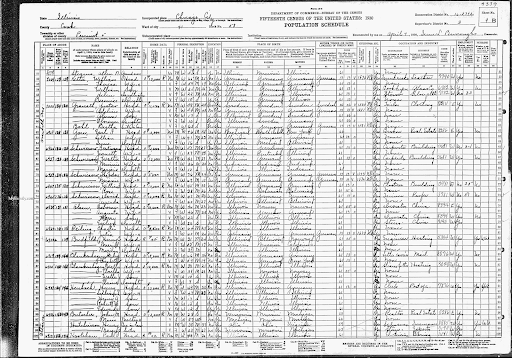
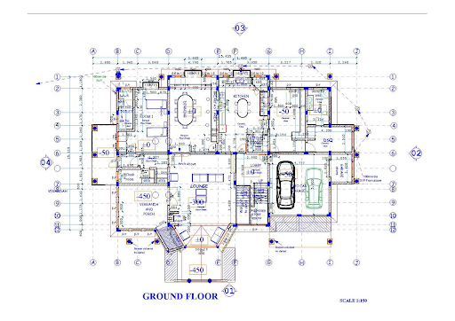
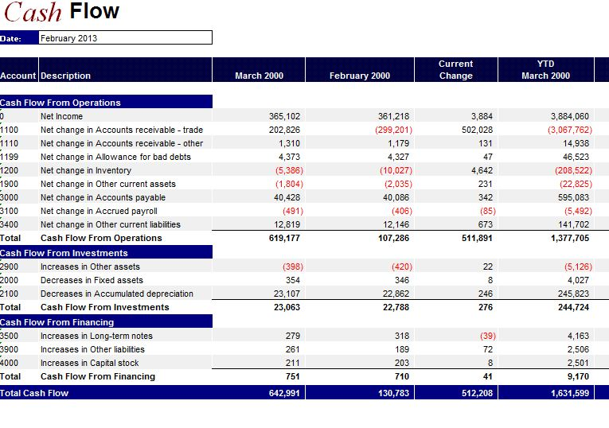

# BSAD 8700 - Business Analytics

---

# Welcome to Business Analytics!

Instructor: Dusty White, PhD

Who am I?
- Economics Faculty Member
    - Undergrad in Economics, from Brigham Young University
    - PhD in Economics, from Washington State University
    - Data and Data Analytics are my passion!

---

# Contacting me

Email: [drwhite@unomaha.edu](mailto:drwhite@unomaha.edu)

Slack: [datascienceuno.slack.com](datascienceuno.slack.com)
- Use the `#businessanalytics` channel for this class 
- Be sure to sign up with your UNO email

I am also happy to arrange meetings by Zoom if you would like a more personal interaction. We can and will find a time that works for both of us!

---

# Course material

The entire course is accessible through [Canvas](unomaha.instructure.com)!
- You will find lectures here
- You will submit assignments and projects here
- You will find links to all documents here

---

# Software needed for class

- [Tableau Desktop](https://www.tableau.com/products/desktop) (we will provide a license for the duration of the course!)
- [Orange Data Mining](https://orange.biolab.si/)
- [SQLectron](https://sqlectron.github.io/), a great and free SQL interface
- Microsoft Excel

---

# What do you hope to get out of this course?

Let me know in the Slack channel!

---

# How will this course help you?

- Learn the principles of analytics
- Learn to communicate with Data Analysts
- Learn when Data Analytics should be used
- Understand when Analytics is not being correctly applied.

---

# I’m a Manager, not a Data Scientist...

“It is important to understand data science even if you never intend to apply it yourself. Data-analytic thinking enables you to evaluate proposals for data mining projects. For example, if an employee, a consultant, or a potential investment target proposes to improve a particular business application by extracting knowledge from data, you should be able to assess the proposal systematically and decide whether it is sound or flawed. …  [Y]ou should be able to spot obvious flaws, unrealistic assumptions, and missing pieces.”
-- Data Science for Business

---

# How can you be successful in this class?

- Do the required readings, and then be active in discussions on Slack!
- Be ready to “get your hands dirty” in lab
- Collaborate with classmates (it's required!)
- Always ask questions!
    - I only know what is interesting to ME
    - Tell me what is interesting to YOU, and I can talk about it

---

# Let's Get Started!

---

# Play a Game

Start by playing a simple game (I recommend about 20 rounds) of [Rock, Paper, Scissors](https://www.afiniti.com/corporate/rock-paper-scissors)

---

# Where do we actually use models like this?

[The Economist](http://www.economist.com/news/finance-and-economics/21705329-governments-have-much-gain-applying-algorithms-public-policy) gives us a few examples:

- Predict Repeat Offenders
- Predict Heart Attacks in Hospital Patients
- Predict at-risk Students, Police Officers
- Find children at risk of lead poisoning

---

# Why are these models so valuable to us?

Computers have the ability to "see" lots of data points at once, so if we use algorithms carefully, we can utilize vast amounts of data to inform our decisions.

---

# What is data?

**Data** is a representation of objects or information from the real world

---

# What is data?

**Data** is a representation of objects or information from the real world
    - Census responses are data

---

---

# What is data?

**Data** is a representation of objects or information from the real world
    - Census responses are data
    - Blueprints are data

---

---

# What is data?

**Data** is a representation of objects or information from the real world
    - Census responses are data
    - Blueprints are data
    - Images are data

---

---

# What is data?

**Data** is a representation of objects or information from the real world
    - Census responses are data
    - Blueprints are data
    - Images are data
    - Financial records are data

---

---

# What is data?

**Data** is a representation of objects or information from the real world
    - Census responses are data
    - Blueprints are data
    - Images are data
    - Financial records are data
    - CAD designs are data

---

 

---

# Defining Data Analytics

Good luck! :stuck_out_tongue:

But seriously, **Data Analytics** is a notoriously broad term describing pretty much anything that uses some data with any amount of analysis of that data to make decisions. Let's try some better terminology...

---

# Definitions

**Predictive Analytics** - Using data to predict outcomes on an individual level

**Forecasting** - Using data to predict macro-level outcomes

---

# Why now? Why not when computers were invented?

- More Data
    - There has been a tremendous increase in the amount of data available to companies
- More Computer Power
    - In 2005, my laptop had ¾GB of RAM, and cost over $2000
    - As of 2014, my laptop (still at just over $2000) had 16GB of RAM, nearly a 2000% increase! The same was true of the increase in processor performance.
    - Today, a similar laptop can be purchased for closer to $1000

---

# Why now?

- Synergy between Data and Computation Power
    - We now have enough data to make meaningful conclusions
    - We have enough computational power!
    - [OmniSci](https://www.omnisci.com/demos/ships/), [more OmniSci](https://www.omnisci.com/blog/visualizing-1.7-billion-stars-in-the-galaxy-at-the-speed-of-light)
    - NVIDIA GTX 1080 Ti: ~11 TFlops (11 trillion operations per second)
        - Only costs $599

---

# So where can we get the data we need?

Anywhere that records are kept, if the owner is willing to share.
- Facebook, Twitter, and LinkedIn all collect very robust information on users and their interactions
- We could also record our own data if needed: surveys, usage statistics, credit card transactions, etc.

---

# So where can we get the data we need?

Some of my all-time favorites:
- [IPUMS.org](https://www.ipums.org/)
- [Data.gov](https://www.data.gov/)
- [ICPSR@UMich](https://www.icpsr.umich.edu/icpsrweb/)

---

# So the data will magically analyze itself, right?!

- Just like a book that is never read, data that is only recorded and never used is not that useful
- We need to find a way to UTILIZE data
- That is what we will learn about during the rest of this class!

---

# We need to ask questions!

---

# Exploring data helps us to find the questions we care about

Let's use Tableau to explore our data

---

# For lab today

- Complete part 1 of the first project
    - Find a group (use Slack!)
    - Play with the [example data]() in Tableau
        - Variable descriptions are available [here]()
    - Choose a research question

If you need, remember that Tableau provides all sorts of great training videos. I have posted some of my favorites on Canvas.