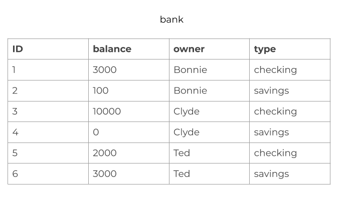

# SQL and Databases

---

### How do you store your data?

Imagine a lot of information about people
- Maybe you have information about alcohol consumption patterns
- Many times, local laws and taxes change how we consume various goods
- In Excel, we would store state-level and individual-level data for each individual

<br> 

Is this the best way to maintain a large amount of data? What if we had information on 40 million people across 50 states?

---

### Relational databases

What if we could avoid storing redundant information wherever possible?
- One table for data on individuals
- One table for data on states (taxes, unemployment, etc.)

<br>

This is exactly what we get with SQL Databases!


---

### Relational databases

In order to work with relational databases, we can use **Structured Query Language** (normall referred to as SQL, pronounced like *sequel*) 

Let's try it out!

---

### Relational databases

We begin by storing our data in tables:


---

### Extracting data - SELECT statements

What do you think would happen if you used the following **SQL** query with our tables?

`SELECT Name, State FROM People`


---

### Extracting data

How about this query?

`SELECT Name, State FROM People WHERE State=‘NE’`


---

### Extracting data

One more example...

`SELECT Name, People.State, Region FROM People, Ptates WHERE People.State=‘NE’  AND People.State=States.State`


---

### A general SQL formula

```sql
SELECT table1.column1, table1.column2, table2.column3
FROM table1, table2
WHERE some_condition, another_condition
```

---

### Grouping and Counting

Here is a new table!


---

### Grouping and Counting

What would happen if we used the following query:

`SELECT Age, COUNT(*) FROM Weasley GROUP BY Age`


---

### Grouping and Counting

What would happen if we used the following query:

`SELECT Age, COUNT(*) FROM Weasley GROUP BY Age`


---

### But I wanted them in order...

`SELECT Age, COUNT(*) FROM weasley GROUP BY Age ORDER BY Age ASC`


---

### Also, that “COUNT(*)” name is terrible...

`SELECT Age, COUNT(*) AS Count FROM weasley GROUP BY Age ORDER BY Age ASC`


---

### SQL and other aggregations

`SELECT type, AVG(balance) AS avgBalance FROM bank GROUP BY type`



---

### SQL and other aggregations

`SELECT type, AVG(balance) AS avgBalance FROM bank GROUP BY type`


---

### SQL and other aggregations

`SELECT type, SUM(balance) AS totalBalance FROM bank GROUP BY type`


---

### SQL and other aggregations

`SELECT type, SUM(balance) AS totalBalance FROM bank GROUP BY type`


---

### SQL and other aggregations

`SELECT type, MIN(balance) AS minBalance, MAX(balance) AS maxBalance FROM bank GROUP BY type`


---

### SQL and other aggregations

`SELECT type, MIN(balance) AS minBalance, MAX(balance) AS maxBalance FROM bank GROUP BY type`


---

### Making new columns using `CASE`

`SELECT Name, CASE WHEN Age=23 THEN 1 ELSE 0 END AS Age23 FROM weasley`


---

### Making new columns using `CASE`

`SELECT Name, CASE WHEN Age=23 THEN 1 ELSE 0 END AS Age23 FROM weasley`


---

### `CASE` statement pattern

```sql
SELECT
    CASE 
        WHEN condition_to_match
            THEN value_if_met
        WHEN next_condition
            THEN next_value
        ...
        ELSE
            value_for_everyone_else
        END
        AS variable_name
FROM
    table_name
```

---

### Random sampling - ignore if you want

```sql
SET @counter = (
        SELECT COUNT(*) AS id 
        FROM ACS 
        WHERE relate=1 AND year=2016 AND statefip=31);

SET @serial=0;

SELECT new.* 
FROM  
    (SELECT @serial := @serial+1 AS id, hhincome, sex, educ, statefip 
     FROM ACS 
     WHERE relate=1 AND year=2016 AND statefip=31)
    AS new,
    
    (SELECT @random:=RAND() AS random, ROUND(@counter*@random) AS draw 
     FROM ACS 
     LIMIT 10000)
    AS test
WHERE new.id=test.draw;

```

---

### Lab Time!

Using the NFL data provided, work with your group to extract the subset of data that you decided to focus on after last week by using SQL queries. When you’re done, save the query results in spreadsheet format (`csv` is the option to choose).
- Use SQLectron to execute queries
- Save the data
- Use it in Tableau!
    - After exploring your data, is your question the same as it was before?