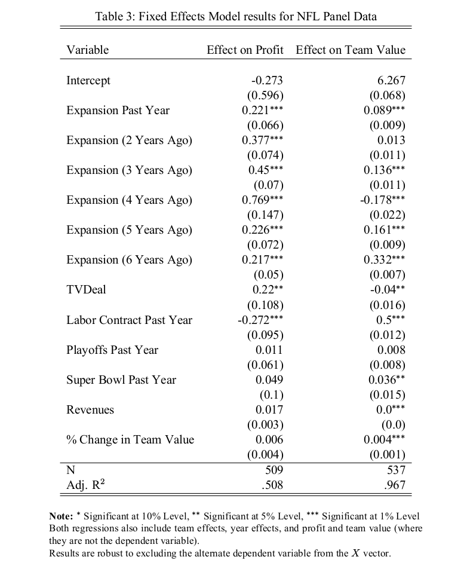
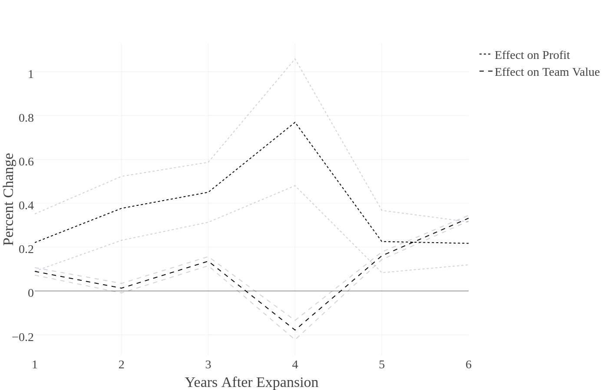
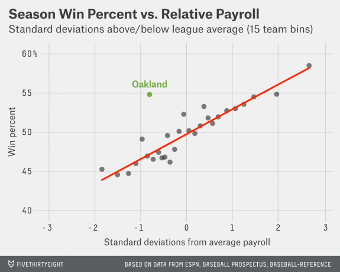
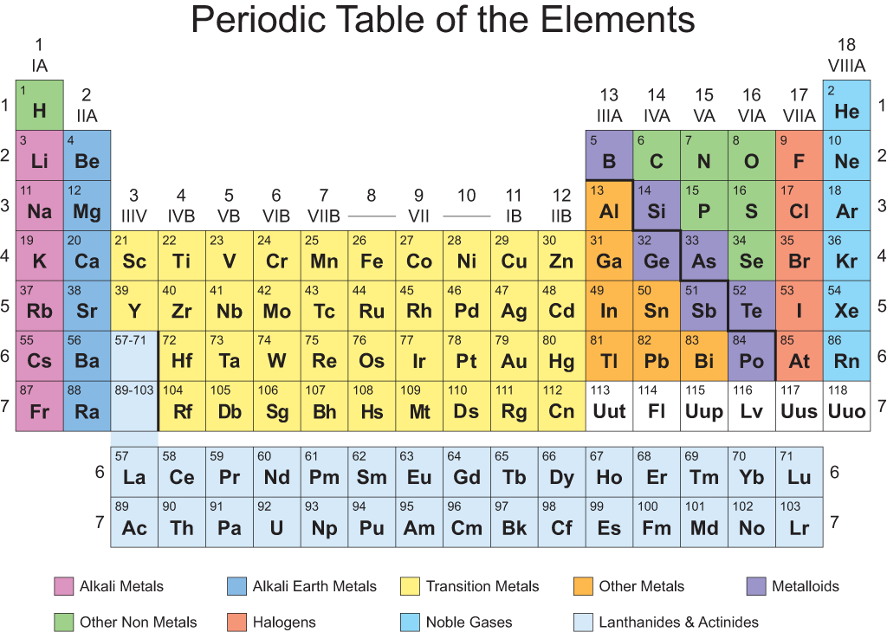
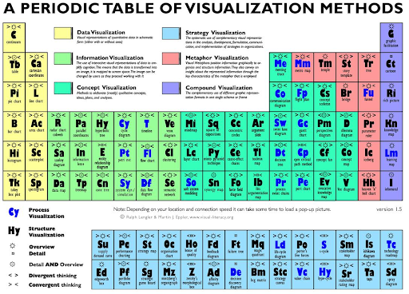
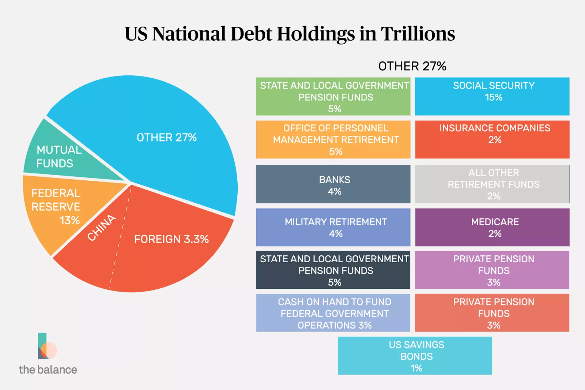

# Data Visualization

###### Drawn from Chapter 1 of [Beautiful Visualization](https://www.amazon.com/Beautiful-Visualization-Looking-through-Practice/dp/1449379869)

---

### Why should we visualize?

---

### What is the goal of visualizing information?

- We are translating information from an effective method for **storing** it to an effective way of **consuming** it!
- My brain (and probably yours, too!) does not like to consume spreadhseets
- We perceive the world visually!

---

### A rockin' table



---

### A rockin' table



---

### Data is the art of storytelling, so let's really make it ART

When we present data, we are trying to tell a story. 
- Kids prefer stories with illustrations, because they are only just learning about how the world looks and works
- Visualization aids unfamiliar audiences

Find a clear story to tell, and let your visuals help you tell it.

---

### What are the challenges of visualization?

1) Dimensionality
    - We often have a lot of different features in our data
    - We can’t easily process more than 2 or 3 at once
2) Context
    - It can be hard to understand a figure’s context

---

### Classic Visuals


---

### Classic Visuals



Our visuals should be
1. Aesthetically Pleasing
2. Novel
3. Informative
4. Efficient

---

### Aesthetically Pleasing

- Don’t let beauty overwhelm data
- Aesthetics should accentuate the information
- Familiar looks and feels can help!

---

### Novel

A visual can be novel in many ways:

- Novel Data
- Novel Insights
- Novel Presentation

<br>

> Most often, designs that delight us do so not because they were designed to be novel, but because they were designed to be effective -- Beautiful Visualization

---

### Informative

> A visual that [is not informative] has failed. -- Beautiful Visualization

**Ask**: What is the intended usage of our visual?

> My goal is to display ______ so that ______ can _______.

- What is our context of use?
- Is it for presentation or exploration?

Catering a visual to our audience ensures that they can quickly obtain the most valuable information.

---

### Informative


---

### Efficient

> Irrelevant data is the same thing as noise. If it’s not helping, it’s probably getting in the way. -- Beautiful Visualization

- The minimum viable product concept is critical in visualization of data
    - Each new element slows your audience's perception of the important points
    - BUT! Don't omit critical components

---

### Efficient


---

### An amazing visual



---

### So terrible...



Maybe we do [this](https://github.com/d3/d3/wiki/Gallery) instead...

Or [this](https://python-graph-gallery.com/)?

Or anything else!


---

### Another atrocity



---

### A template process

1. Write down your goal and intent for the visual
2. Gather the data that will help you achieve that goal
3. Decide how to tell your intended story with the data
4. Apply a visual representation of your data

---
<style scoped>
em {color: coral}
</style>

### Example

I worked on a project exploring the pay and education levels in different occupations in Nebraska relative to other states. I prepared the project by following the steps from the last slide:

1. Write down your goal and intent for the visual

My goal is to ***display wage and education patterns in occupations over time*** so that ***policymakers*** can ***understand the relationship between education and productivity in various job categories***.

---

### Example

2. Gather the data that will help you achieve that goal

    Here is one of the SQL Statements that I used:

    ```sql 
    SELECT 
        product/nobs AS wage, 
        100.0*product/(
            SELECT SUM(product) 
            FROM reducedOcc 
            WHERE statefip=31 
            GROUP BY year) AS percent 
    FROM reducedOcc 
    WHERE 
        occ2010=1010 
        AND statefip=31 
    GROUP BY year 
    ORDER BY year ASC
    ```

---

### Example

3. Decide how to tell your intended story with the data
4. Apply a visual representation of your data

Let’s take a look at a webpage I made to explore and test my visuals:

[http://dash4hank.herokuapp.com/](http://dash4hank.herokuapp.com/)

---

### For Lab:

Using the data you extraced last week, work with your group to visualize the answers to your research question in Tableau. It will be useful to follow the steps described earlier for creating effective visualizations of data:

1. Write down your goal and intent for the visuals
2. Gather the data that will help you achieve that goal
3. Decide how to tell your intended story with the data
4. Create the visual representations of your data

Remember to focus on making visuals **Aesthetically Pleasing**, **Novel**, **Informative**, and **Efficient**
