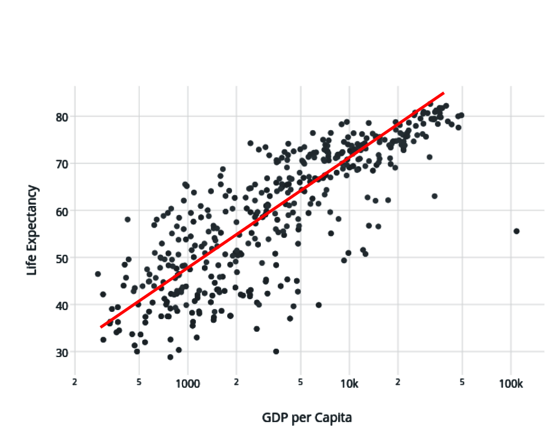
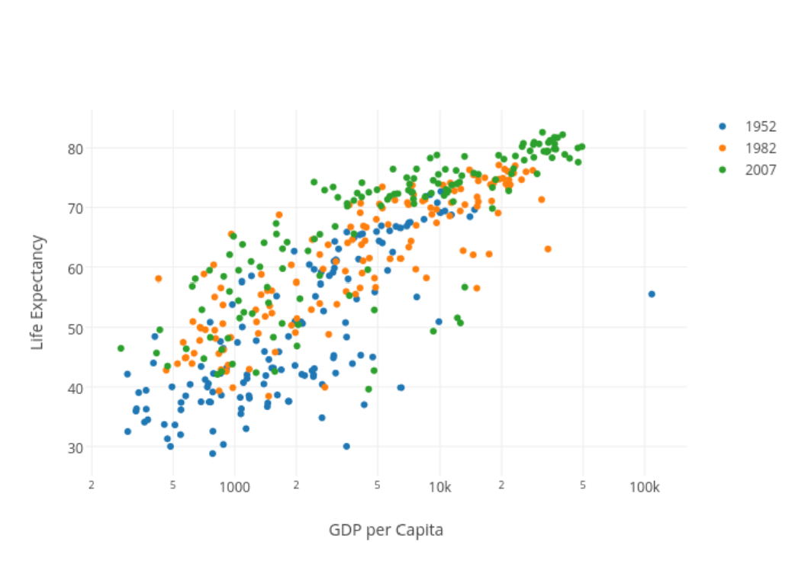
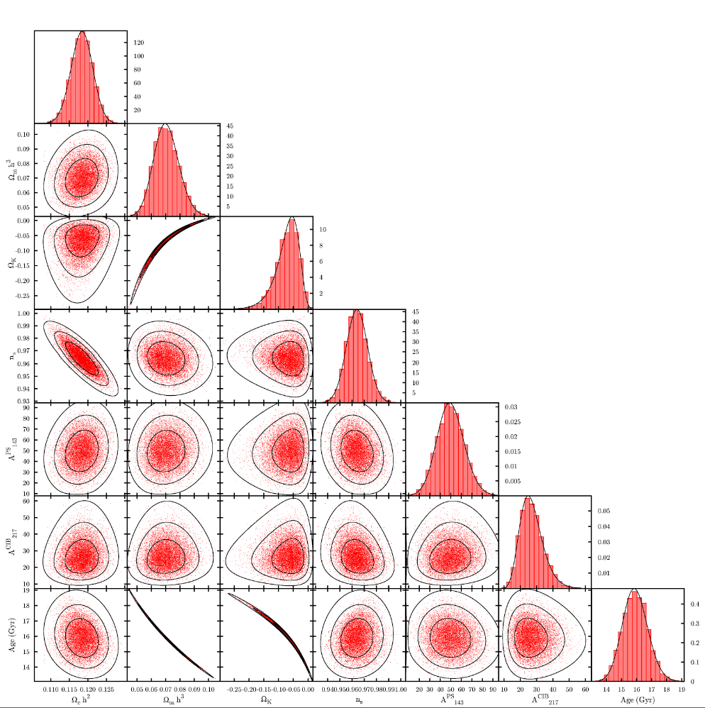
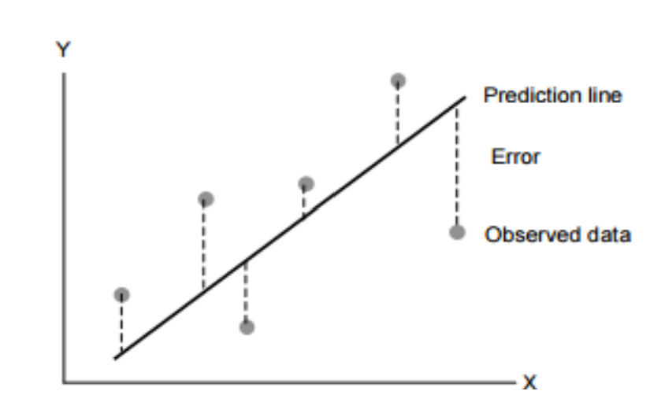
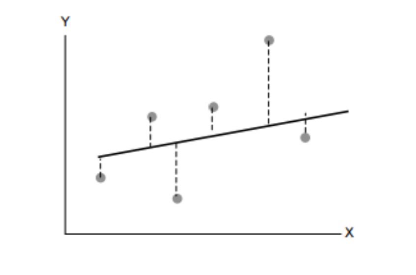
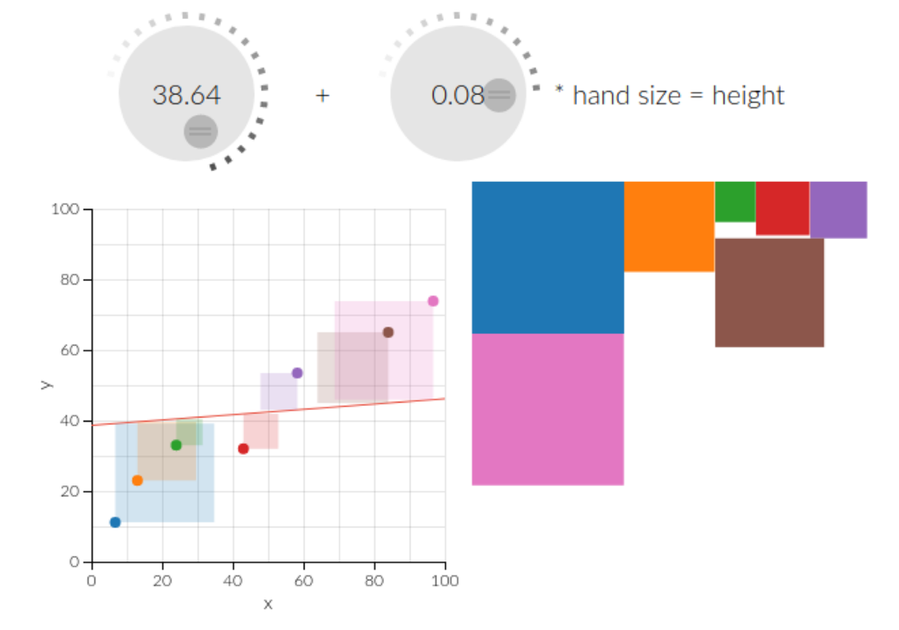
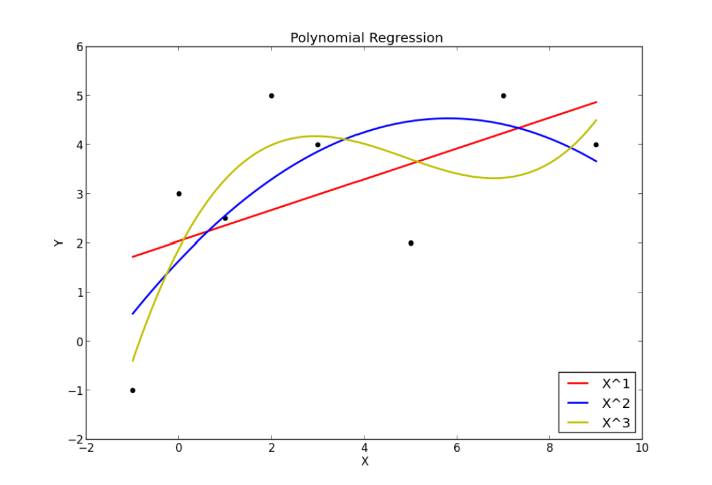
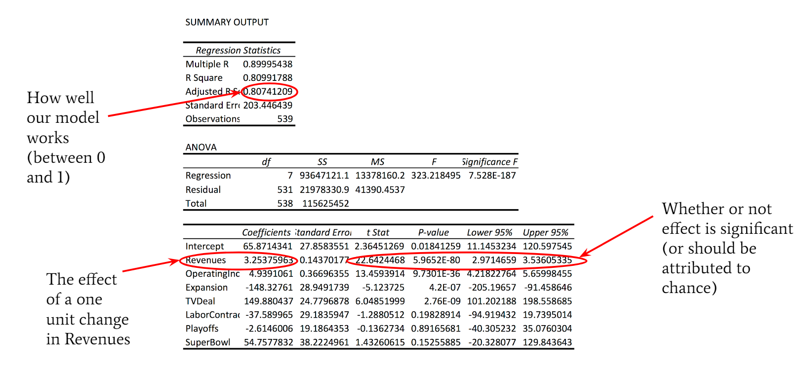

# Introduction to Regressions

---

# Cause and Effect

[Correlation](http://www.tylervigen.com/spurious-correlations): Two variables are correlated when changes in one variable occur in a pattern corresponding to changes in the other.

---

# Cause and Effect

Causation: One variable moves, and the second variable changes because of the movement of the first.

---

# Questioning Causality

When we suspect a causal relationship (that $x$ causes $y$), it is important to ask ourselves several questions:

1. Is it possible that $y$ causes $x$ instead?
2. It is possible that $z$ (a new factor that we haven't considered before) is causing both $x$ and $y$?
3. Could the relationship have been observed by chance?

---

# Establishing Causality

In order to establish causality, we need to meet several conditions:

- We can explain **why** $x$ causes $y$
- We can demonstrate that **nothing else is driving the changes** (within reason)
- We can show that there is a **correlation** between $x$ and $y$

---

# Ceteris Paribus

*ceteris paribus* means "all else equal"

---

# Why I stink at golf

Why am I always in the sand trap?
- Need to isolate the variables

---

# Why I stink at golf

- Is it my club?
- My swing?
- The wind? (definitely the wind)

---

# To uncover the effect

Swing my club 100 times with each golf club
- Keeping the wind, my stance, my swing, etc. consistent
- Is that even really possible?
- In many cases, no

---

# Regression analysis

- Allows us to **act as if nothing else were changing**
- Mathematicaly isolates the effect of each individual **variable** on the outcome of interest
    - Variables are the factors that we want to include in our model

---

# Regression analysis

- Think about it like a trend line!

---

# Regression analysis

Whoops! What if there is another variable?

---

# Regression analysis

Or lots of variables??

---

# Minimize Errors and Best Fit Lines

| Best Fit | Something Else |
:-------------------------:|:-------------------------:
  |  

---

# Minimize Errors and Best Fit Lines

[Try it by hand!](http://setosa.io/ev/ordinary-least-squares-regression/)

---

# Why LINEAR regression?

- Faster
- More honest

---

# Regression in Excel - Disclaimer

First, when doing regression in the real world&trade;, don't use Excel.
- If you need to do real regressions for a project, let me know and we can talk about appropriate tools

Now that we have that out of the way, let's do regression in Excel!

---

# Regression in Excel

---

# Regression terms

- **Coefficient**: This is the effect of changing a variable by one unit (from “untreated” to “treated”)
- **Standard Error (Standard Deviation)**: Measures how noisy the effect of the independent variable is on the dependent variable
    - Larger numbers indicate more noise

---

# Regression terms

- **Confidence Interval**: Assuming our regression analysis includes all relevant information, we expect that the true coefficient (treatment effect) lies within this range 95% of the time (for a 95% confidence interval)

- **Statistical Significance**: When the Average Treatment Effect has a confidence interval (at 95% or 99% levels, typically) that does not include 0

---

# What we assume

1) Effects are Linear (there are some workarounds)
2) Errors are normally distributed (bell-shaped)
3) Variables are not Collinear
4) No Autocorrelation (problematic for time series data)
5) Homoskedasticity (errors are shaped the same across all observations)

---

# What we assume

All of these assumptions can be modified, but not by Excel. We **almost always** violate at least one assumption with any given dataset

---

# When should we use regression, then?

- Regression Analysis is most useful when you care about WHY
- If you want to just predict WHAT will happen next, we have better tools for you! (We will spend the rest of the course looking at them)

---

# For Lab

Work with your group to analyze your data from previous labs using regression analysis. Use the scientific method:
- Write down your hypothesis (what you believe should be the relationship between variables and why you think that is true)
- Organize the data
- Implement the regression(s)
- Decide whether or not the regression results support your hypothesis, and what this means for your conclusions and visuals
