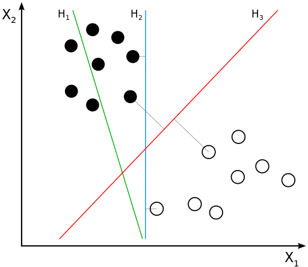

# Classification and Supervised Learning

---

# Machine learning

So what is it?

---

# Machine learning

- A technique that uses data to teach patterns to computers
- The way computers remember allows them to make excellent decisions in very specific cases based on the data provided

---

# Machine learning is NOT
a sentient robot. It is just an algorithm that has been taught to do one specific task, and ideally to do that task quickly and accurately

---

# Types of machine learning

- Supervised learning
- Unsupervised learning
- Reinforcement learning

---

# Supervised learning

- Insurance companies may want to predict who is most likely to make a claim in the next period
    - Data from past periods will contain information about people that did and did not file claims
- **Any case when we have clear information about the outcome, and can use that knowldege to train the model**

---

# Unsupervised learning

- Used for recommended movies on Netflix, or suggested purchases on Amazon, where we don’t have a clear fix on what exactly we (as analysts) are looking for
- **Any case where we seek to group observations by deciding which are most closely related to one another based on the data inputs**
    - There is not necessarily a "true" value or "right" answer in unsupervised learning

---

# Reinforcement learning

- Used to teach machines to play games like chess, or to perform complex tasks where success or failure are not immediately clear (driving a car?)
- **Any case where success cannot be directly identified, or is the result of many steps requiring analysis**

---

# Classification

- A subtype of **supervised learning**
- The goal is to separate individuals into defined groups, or classes
- Classification problems seek to determine which features in the data **predict the class/category** an individual (or any other kind of observation) belongs to

---

# Methods of Classification - Decision Trees

- Choose features (variables) from the data
- Determine how their value impacts outcomes
- Repeat for many variables, until outcomes are neatly categorized

---

# Methods of Classification - SVM

- SVM = Support Vector Machine
- Find the vector (line/curve) that gives the BEST separation of your data.
- How appropriate are the vectors ($H$’s) in this picture?

---

# Methods of Classification - SVM

- H1 does not separate our data
- H2 separates our data, but comes close to several data points (might be error-prone)
- H3 seems to give us separation and the largest possible buffer

---

# Methods of Classification - Logistic Regression

- Regression analysis, but focused on predicting discrete outcomes
- Analyze the probability that an outcome occurs, given what is already known

---

# Methods of Classification - Logistic Regression

- Advantage: Can explain the **why**, just like normal regressions
- Disadvantage: Not as easy to understand as linear regression or decision trees

---

# Our new data

Let me take you on a tour of the dataset we will be using:
[Click-Through Rate Prediction](https://github.com/dustywhite7/BSAD8700/tree/master/Data%20Files). The data are divided into [training data](https://github.com/dustywhite7/BSAD8700/raw/master/Data%20Files/ctr_train_data.csv) and [testing data](https://github.com/dustywhite7/BSAD8700/raw/master/Data%20Files/ctr_test_data.csv). For now, just use the **training data**.

Information on the data is provided for your reference in the accompanying [data dictionary](https://raw.githubusercontent.com/dustywhite7/BSAD8700/master/Data%20Files/ctrDataDescription.txt)

---

# For lab

- With your team, check out the data available to you
- Together, choose a decision pattern for classifying observations in the data set MANUALLY
    - This means writing down a rule (or series of rules) that provide the most accurate prediction possible for our training data
    - You are welome to use Tableau or Excel/Google Sheets to help you with this process
    - Please use plots, regressions, or written formulas to justify your rule(s)
