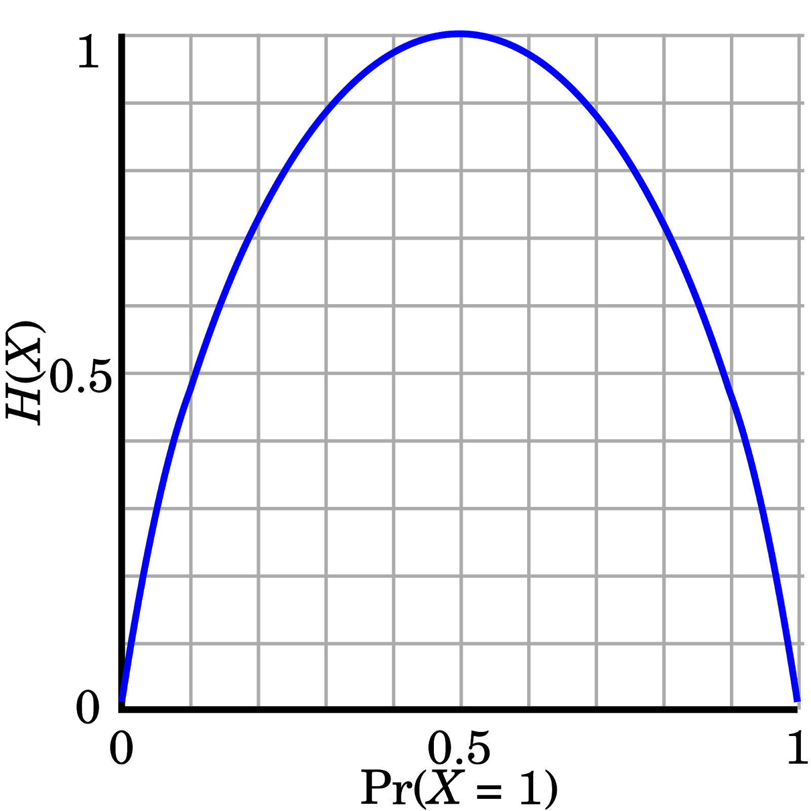

# Decision Trees

---

# Entropy

- A measure of how chaotic a system is
    - High entropy $\rightarrow$ Less information
    - As we move toward certainty, entropy $\rightarrow$ 0

---

# Calculate entropy

$$ H(x) = -\sum_{i=1}^n p(x_i) \; log \; p(x_i) $$

---

# So what?

Entropy can be used as a measure to determine how we can use information effectively
- Use it to create **Decision Trees**

---

# Decision trees

- Made up of nodes and branches
- Seek to "purify" information about different groups
- They are like a statistics version of "20 questions" (but can absolutely have different numbers of questions)

---

# Entropy and decision trees

- Entropy is one way that we choose which data to use in our tree
- If we have many features (the most common case), then trial and error would take forever! (Remember last lab??)

---

# Choosing a variable

Let's say that we want to predict whether or not someone wil click on an online advertisement. The average rate of clicking in the population is 50%
- What information can we use to improve our understanding?
- Entropy can answer that!

---

# Choosing a variable

- Instagram: Instagram viewers click through 60% of the time
- Phone: Phone viewers click through 55% of the time
- Night: Night viewers click through 62% of the time
- International: International viewers click through 25% of the time

Which variable is most informative? Use our **entropy equation** to find out!

---

# Doing the Math - Instagram

Population Entropy:

$$ -1\cdot( 0.5\cdot ln\; 0.5 + 0.5 \cdot ln\; 0.5 ) = .693 $$

Entropy of Instagram Viewers:

$$ -1\cdot( 0.6\cdot ln\; 0.6 + 0.4 \cdot ln\; 0.4 ) = .673 $$

---

# Doing the Math - Phone

Population Entropy:

$$ -1\cdot( 0.5\cdot ln\; 0.5 + 0.5 \cdot ln\; 0.5 ) = .693 $$

Entropy of Phone Viewers:

$$ -1\cdot( 0.55\cdot ln\; 0.55 + 0.45 \cdot ln\; 0.45 ) = .688 $$

---

# Doing the Math - Night

Population Entropy:

$$ -1\cdot( 0.5\cdot ln\; 0.5 + 0.5 \cdot ln\; 0.5 ) = .693 $$

Entropy of Night Viewers:

$$ -1\cdot( 0.62\cdot ln\; 0.62 + 0.38 \cdot ln\; 0.38 ) = .664 $$

---

# Doing the Math - International

Population Entropy:

$$ -1\cdot( 0.5\cdot ln\; 0.5 + 0.5 \cdot ln\; 0.5 ) = .693 $$

Entropy of International Viewers:

$$ -1\cdot( 0.25\cdot ln\; 0.25 + 0.75 \cdot ln\; 0.75 ) = .562 $$

---

# Making the choice

Population entropy: .693

Instagram entropy: .673
Phone entropy: .688
Night entropy: .664
International entropy: .562

 

Which variable is most informative?

---

# Making the choice

Population entropy: .693

Instagram entropy: .673
Phone entropy: .688
Night entropy: .664
**International entropy: .562**

 

Using status as an international viewer provides us the largest amount of information among all available variables!

---

# Then what?

- Divide the data between those who are viewing our ads internationally, and those who are not
- Then we can keep dividing the data to find more and more certain outcomes

---

# Key takeaways

1) More uncertainty $\rightarrow$ Higher entropy
2) More possible outcomes $\rightarrow$ Higher entropy

---

# How big should a tree grow?

We can stop "growing" our tree when we meet one or more **stopping rules**. These rules will ask

1) Have we asked too many questions?
2) Are our samples too small now that we have broken them up into smaller groups?
3) Have we reached a predetermined level of sample purity?

---

# Making a model

Let's make a model in [Orange](https://orange.biolab.si/)!

I'll walk you through it.

---

# For lab

- Together with your team, build a few Decision Trees (and try out some of the other classifiers) using Orange. Try to explore the different options available to you, and figure out which adjustments make the model more or less accurate in predicting outcomes.
- If you are lost, ASK QUESTIONS! You might also want to refer to the [Orange tutorial videos](https://www.youtube.com/playlist?list=PLmNPvQr9Tf-ZSDLwOzxpvY-HrE0yv-8Fy).
