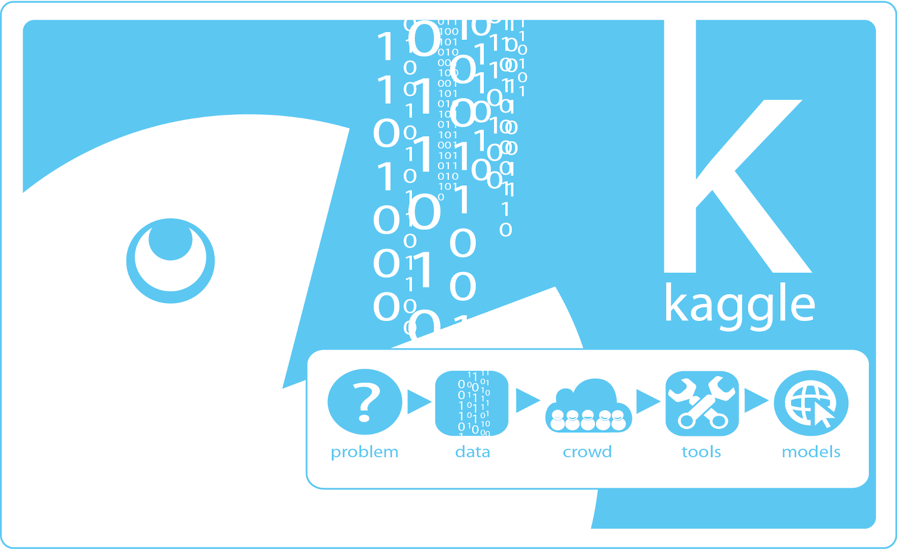

# Ensemble Methods

---

# Practicing data science

- [Kaggle](https://www.kaggle.com/)
- Crowdsourcing the problems that firms face in data analysis

---

# Measuring classification accuracy

- **Accuracy**: the percentage of correct predictions among all predictions

 

$$ \text{Accuracy} = \frac{\#\; \text{Correct}}{\#\; \text{Total}} $$

---

# Measuring classification accuracy

- **Precision**: the percentage of successes that were correctly identified

 

$$ \text{Precision} = \frac{\#\; \text{Predicted True Positives}}{\#\; \text{All True Positives}} $$

---

# Measuring classification accuracy

- **Recall**: the percentage of predicted successes that were actually successes

 

$$ \text{Recall} = \frac{\#\; \text{Predicted True Positives}}{\#\; \text{All Predicted Positives}} $$

---

# Measuring classification accuracy

- **F1**: a weighted average of **precision** and **recall**

 

$$ \text{F1} = \frac{2 \cdot \text{Precision} \cdot \text{Recall}}{\text{Precision} + \text{Recall}} $$

---

# Ensembles in the wild

- People become ensembles when we vote
- Reduces the noise in important outcomes

---

# Ensembles in the wild

- Winning against the line in sports betting is hard!
    - You have to beat an **ensemble**!
- [Accuracy of Groups in Sports Betting](http://www.ecm.bwl.uni-muenchen.de/publikationen/pdf/sports_forec.pdf)

---

# Ensemble models are computer democracy

---

# Random forests

- A forest of decision trees
- Each tree is assigned a **random** set of **variables and data**
- Lots of unique trees
- The trees vote according to their predictions

---

# Other ensembles

- **Bagging**
    - The concept behind random forests
    - Make lots of similar models, then aggregate predicitons
- **Boosting**
    - Iterative models
    - Train a model to focus on its weaknesses
    - Each round emphasizes the remaining mistakes

---

# Other ensembles

- **Stacking**
    - Using models as inputs to other models
    - Build one or more SVMs or linear models (or any other kind of model!), and then feed the results into a new model

---

# xgBoost

Just like Random Forests are extremely popular, **xgBoost** is a boosting model based on trees that is powerful, efficient, and popular in predictive modeling

---

# For lab

- Together with your team, build an ensemble model. You can use Random Forests, another ensemble model, or even experiment by building your own!
- Try to get the best accuracy (or precision! or recall! or F1!) that you can!
- If you are lost, ASK QUESTIONS! You might also want to refer to the [tutorial videos](https://www.youtube.com/playlist?list=PLmNPvQr9Tf-ZSDLwOzxpvY-HrE0yv-8Fy) again.
