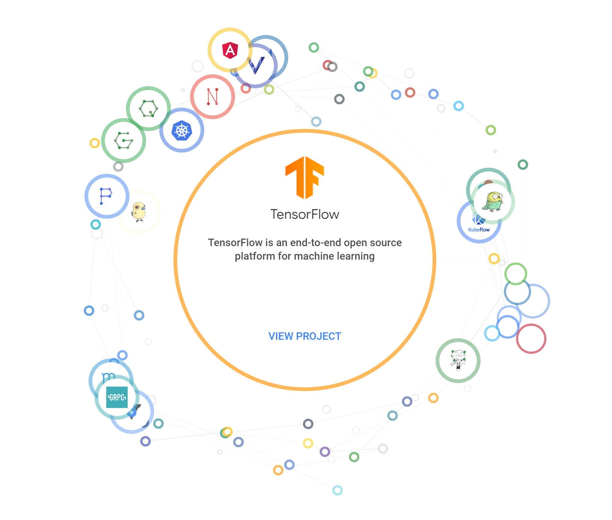
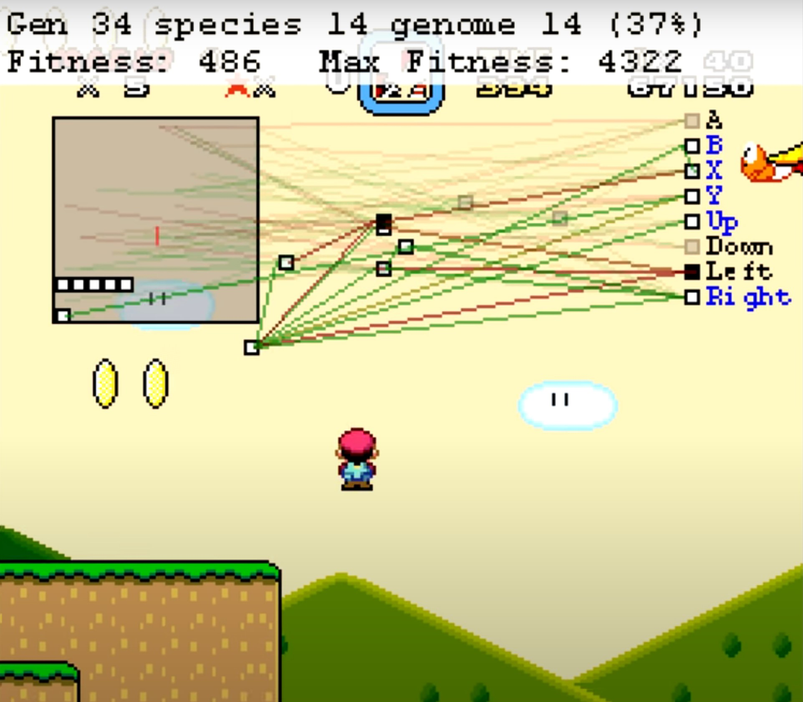
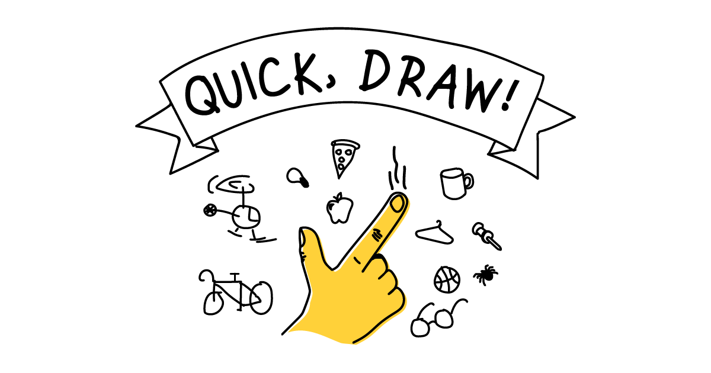
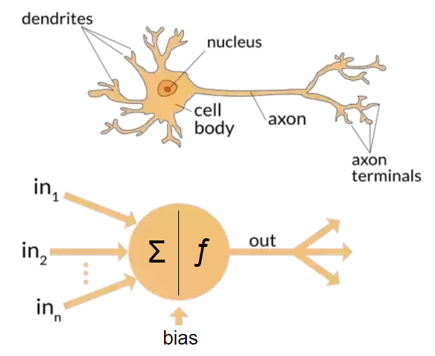
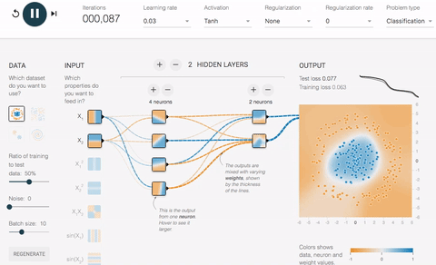
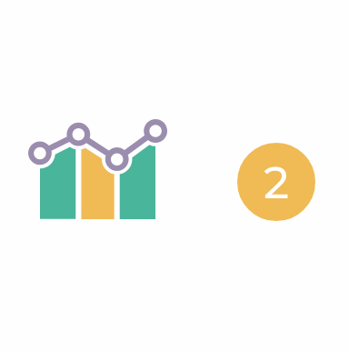
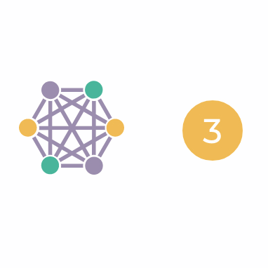

# Data Maturity and Cutting Edge Models

---

# Open-source - why?

What makes a good predictive model?
- Good code
- **Helpful data**

Firms share their code, while protecting their data

---

# Examples

[Facebook Open Source Projects](https://code.facebook.com/projects/)

[PyTorch](https://pytorch.org/)

---

# Examples

[Tensorflow](https://www.tensorflow.org/)

[Android](https://source.android.com/)

---

# Neural Networks

- Designed to simulate the way that neurons in our brains work
- [MarI/O](https://www.youtube.com/watch?v=qv6UVOQ0F44&feature=emb_logo)

---

# Neural Networks

- Allows for very abstract problems to be represented and solved
- [MariFlow](https://www.youtube.com/watch?v=qv6UVOQ0F44&feature=emb_logo)

---

# Let's interact with a neural net

[Quick, Draw! Game](https://aiexperiments.withgoogle.com/quick-draw)

---

# How does it work?

- Inputs are combined into a single value
- If the value is high enough, the neuron "activates" and sends a signal forward

---

# Build one!

- [Tensorflow Playground](http://playground.tensorflow.org)

---

# Data Maturity Model

[From MHR](https://www.mhranalytics.com/data-maturity/)

---

# Operational

Analytics are only done where they are REQUIRED, and are not used to coordinate or improve processes

---

# Descriptive

BI is used to report, but not used uniformly or consistently

---

# Planning

Analytics are now used consistently, and to coordinate planning across the organization

---

# Predictive

The organization moves beyond using data to plan, and begins using it to inform future decisions by predicting outcomes

---

# Prescriptive

Data are used to FIND problems, in addition to planning and predicting based on known problems

---

# Where is your organization?

---

# For lab

Finish your second project!

Thanks for a fun semester!